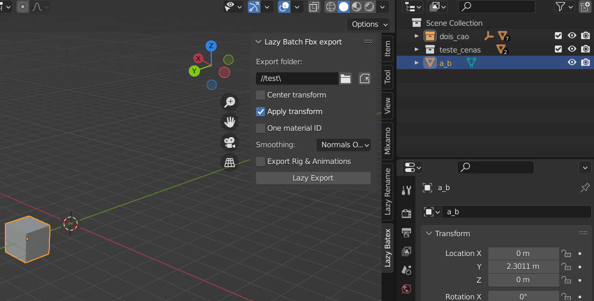

# Lazy Batex 📦
A Blender Plugin created to help in the asset creation process for the [Lazy Builder Library](https://github.com/wafflesgama/LazyBuilderLibrary). 

This a modified version of the [Batex plugin](https://github.com/jayanam/batex), to quickly export assets in FBX format from the base library path

### Extending Features 
- Exported objects creates & follows the Lazy Library folder structure: **./exportFolder/ItemId/ItemId_ItemTypeId.fbx**

- If the selected object(s) contain a wrapping collection - the collection is exported as a single parented object (if an 'empty' is present in the collection it will be considered as the collection origin point)

## Installing 💾
1. Download the latest **lazy-batex.zip** file from the [Releases section](https://github.com/wafflesgama/LazyBatex/releases) 
2. Open Blender
3. Go to edit -> preferences -> addons
4. Click install button
5. Select the **lazy-batex.zip** file you've downloaded
6. Check the box Next to newly added entry to enable plugin

## Usage 🧑‍💻
* After installing **Lazy Batex** panel is added to the sidebar (below item/tool/view, right side of 3d viewport)
* Sidebar can be shown/hidden with the 'N' key.
